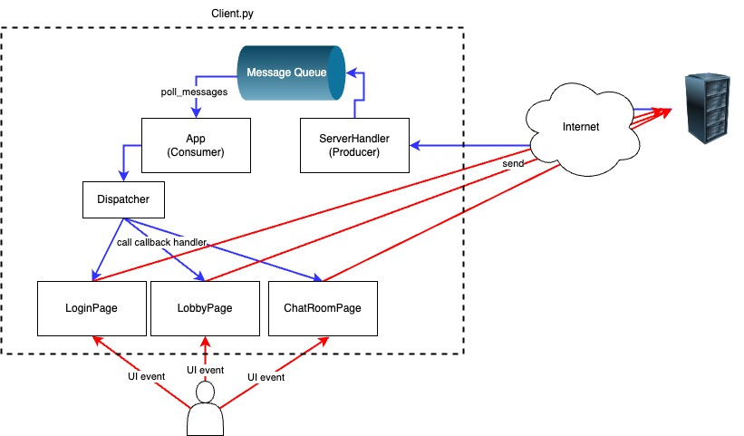
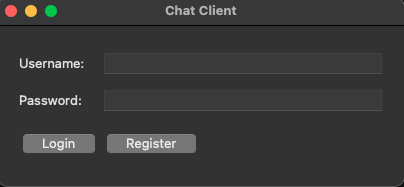
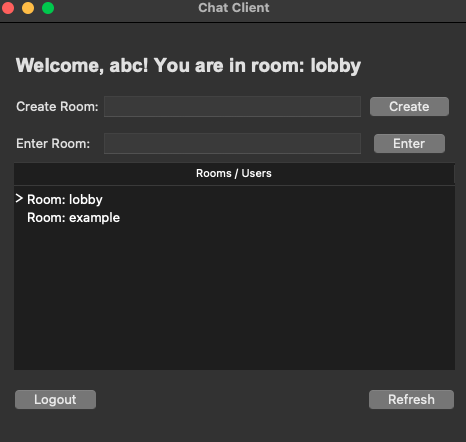
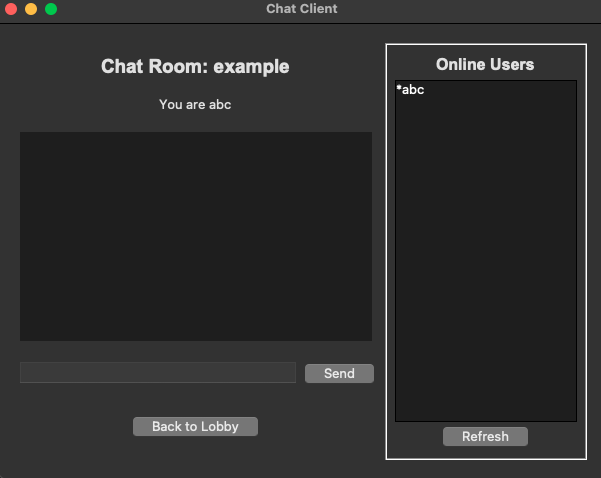

# **Python Chat Room**

## **Design Overview**

### **Server**


1. The server is implemented using a **multi-threaded architecture**. Each incoming connection spawns a new thread.
2. Each thread is managed by a ClientHandler, which operates as a [state machine](./diagrams/server_state_machine.jpg) to handle the full client interaction lifecycle.

3. **Concurrency Control**

   To ensure data consistency in a multi-threaded environment, shared in-memory session data (e.g., online_users, chat_rooms) is managed through a ChatData structure protected by a **reentrant mutex lock**.

4. **Database**

   User credentials (username and password) are stored in a **SQLite** database, accessed via **SQLAlchemy Core**.

5. **Security**
   1. Passwords are hashed before being stored.
   2. All client-server communication is secured using **SSL/TLS encryption**.

---

### **Client**


In the diagram, blue arrows represent server responses/pushes, and red arrows represent user-triggered UI requests.

1. The client’s main thread runs a **Tkinter event loop**, which handles both **UI events** (e.g., button clicks, message sending) and **server responses or push events**.

2. **Decoupled Class Design**
   1. ServerHandler manages all server communication. To prevent blocking the Tkinter event loop, it runs a **dedicated receiver thread** that continuously listens for incoming messages from the server and places them into a **queue**, acting as the **producer**.
   2. App runs on the **main thread**, handling page transitions and serving as the **consumer**, retrieving messages from the queue and dispatching them to the Dispatcher.
   3. Dispatcher is responsible for **event routing**—it establishes relationships between events and callbacks without requiring awareness of individual UI pages. Each page (LoginPage, LobbyPage, ChatRoomPage) registers its callbacks with the dispatcher.

---

### **Communication Protocol**

1. **Message Framing**

   Because TCP may cause packet concatenation (the “sticky packet” issue), the protocol adopts a **length-prefixed design**. Each message begins with a 4-byte header indicating message length. The application maintains an internal buffer to reconstruct complete messages.

2. **Message Format**

   The client and server communicate using a **custom JSON-based protocol**, validated using **Pydantic** to ensure schema correctness.

---

## How to run it?

1. Generating a Self-Signed SSL/TLS Certificate

   This project uses a self-signed certificate for demonstration purposes.
   To generate server.key, server.csr, and server.crt, use the following commands:

   ```bash
   # 1. Generate a private key (server.key)
   openssl genrsa -out server.key 2048

   # 2. Create a certificate signing request (server.csr)
   openssl req -new -key server.key -out server.csr

   # 3. Generate a self-signed certificate valid for 365 days (server.crt)
   openssl x509 -req -days 365 -in server.csr -signkey server.key -out server.crt
   ```

2. Virtual environment
   ```bash
   pip install -r requirements.txt
   ```
3. Run the server and client
   ```bash
   python server.py
   python client.py
   ```

## How to use it?

## How to Use

1. Register an account and log in.

   

2. On the **Lobby** page, you can:

   

   - Create a new room
   - Enter an existing room
   - Log out

   * Click the **Refresh** button to update the list of online users and rooms.

3. On the **Chatroom** page, you can:

   

   - Send messages
   - Refresh the online user list
   - Return to the lobby

   * To send a private message to a specific user, use the format:
     ```
     \private <receiver> <your message>
     ```

## Message Format References

### **Client → Server**

### **1. Authentication**

Used for user registration and login.

```
{ "type": "register", "data": { "username": "harper", "password": "1234" } }
{ "type": "login",    "data": { "username": "harper", "password": "1234" } }
```

---

### **2. Lobby Operations**

Commands available in the lobby state.

```
{ "type": "list" }                                       // List all online users
{ "type": "logout" }                                     // Log out from the server
{ "type": "enter",  "data": { "room": "tech_talk" } }    // Enter an existing chatroom
{ "type": "create", "data": { "room": "tech_talk" } }    // Create a new chatroom
```

---

### **3. Chatroom Operations**

Commands available after entering a chatroom.

```
{ "type": "exit" }                                       // Leave current chatroom
{ "type": "list" }                                       // List users in current room
{ "type": "msg", "data": { "from": "sender", "to": "receiver", "text": "Hello everyone!" } } // Send message
```

---

### **Server → Client**

### **1. Authentication Responses**

1. **Success**

   ```
   {
     "type": "login|register",
     "status": "ok",
     "data": { "username": "harper", "chatroom": "lobby" },
     "message": "Login successful"
   }
   ```

2. **Failure**

   ```
   {
     "type": "login|register",
     "status": "error",
     "message": "Password incorrect"
   }
   ```

---

### **2. Lobby Responses**

1. **User/Room List**

   ```
   {
     "type": "list",
     "status": "ok",
     "data": {
       "room1": ["user1", "user2", "user3"],
       "room2": ["user4"],
       "room3": []
     }
   }
   ```

2. **Enter Room – Success**

   ```
   {
     "type": "enter",
     "status": "ok",
     "data": { "username": "username", "room": "chatroom" },
     "message": "Welcome to the chatroom"
   }
   ```

3. **Enter Room – Failure**

   ```
   {
     "type": "enter",
     "status": "error",
     "message": "Error message"
   }
   ```

4. **Create Room – Success**

   ```
   {
     "type": "create",
     "status": "ok",
     "message": "room_name created successfully"
   }
   ```

5. **Create Room – Failure**

   ```
   {
     "type": "create",
     "status": "error",
     "message": "Error message"
   }
   ```

---

### **3. Chatroom Responses**

1. **Exit – Success**

   ```
   {
     "type": "exit",
     "status": "ok",
     "message": "Exited chatroom, returned to lobby"
   }
   ```

2. **Exit – Failure**

   ```
   {
     "type": "exit",
     "status": "error",
     "message": "Error message"
   }
   ```

3. **New Message (Broadcast or Private)**

   **Success:**

   ```
   {
     "type": "msg",
     "status": "ok",
     "data": { "to": "public", "from": "sender", "text": "Hello everyone!" }
   }
   ```

   **Error:**

   ```
   {
     "type": "msg",
     "status": "error",
     "message": "Error message"
   }
   ```

## TODO

1. Add friends
2. Real-time update of online states
